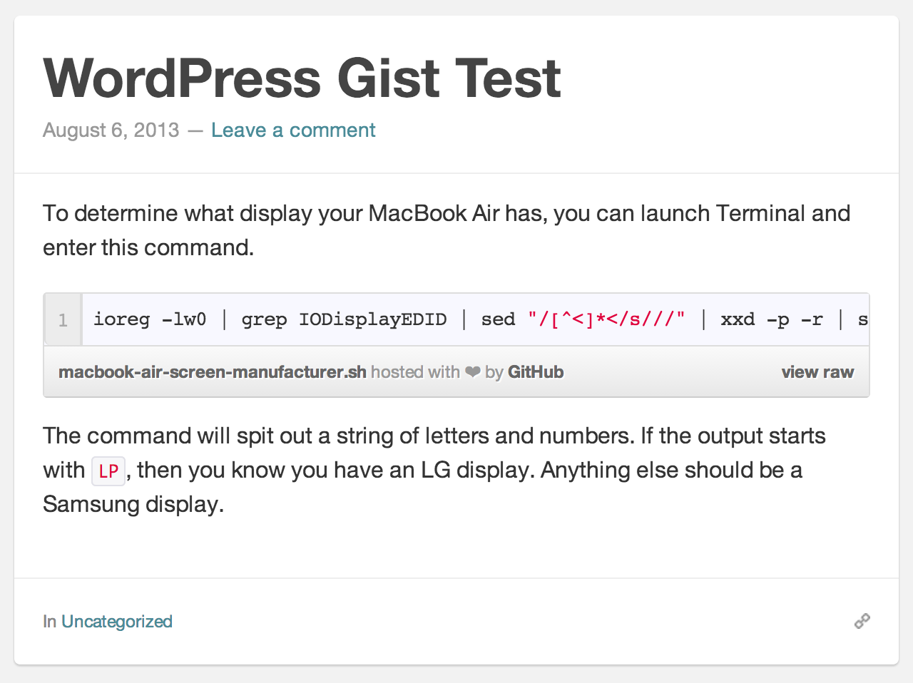

# WordPress Gist

## Description

Adds support for [GitHib Gist](https://gist.github.com/) embeds in WordPress.

Two primary features.

1. Adds styles to make GitHub Gists look pretty within WordPress.
2. Adds shortcode capabilities to embed GitHub Gists into posts and pages, even support for specific files within a Gist.

## Usage

Within a post or page, simply use the following shortcode by supplying the URL of the Gist you want to show.

`[gist url="https://gist.github.com/manovotny/5014426"]`

If your Gist has [multiple files](https://gist.github.com/manovotny/5014426), you can also tell the shortcode to only display a certain file within the Gist, like so.

`[gist url="https://gist.github.com/manovotny/5014426" file="find-this-line-in-load-styles.php"]`

## Screenshot

## Installation

There are two ways to install WordPress plugins: via the WordPress Dashboard (recommended) and via FTP. 

*Installing via the WordPress Dashboard is recommended because this process makes sure all the file and folder permissions are set correctly.*

### Using the WordPress Dashboard

1. Download the [plugin](https://github.com/manovotny/wordpress-gist/archive/master.zip).
2. In the WordPress Dashboard, locate the **Plugins** menu.
6. In the **Plugins** menu, click on **Add New**.
7. On the **Add New** page, click on the **Upload** link at the top of the page.
8. On the **Upload** page, locate the `wordpress-gist-master.zip` archive (zip) on your computer ()downloaded in Step #1) and click **Install Now**.
9. On the successful upload page, click **Activate**.

### Using FTP

1. Download the [plugin](https://github.com/manovotny/wordpress-gist/archive/master.zip).
2. Unzip the `wordpress-gist-master.zip` archive on your computer.
3. Connect to your server via S/FTP.
5. Upload the `wordpress-gist-master` directory to the `/wp-content/plugins/` directory on your server.
6. In the WordPress Dashboard, navigate to the **Installed Plugins** page under the **Plugins** menu.
7. Locate **WordPress Gist** and click **Activate**.

## Compatibility

This plugin has been tested with the following. 

*Other versions / themes may or may not work.*

* [WordPress](http://wordpress.org) 3.5+
* Themes:
    * [Standard](http://standardtheme.com) 3.0+
    * [TwentyThirteen](http://theme.wordpress.com/themes/twentythirteen/)

## Credit

* [Michael Novotny](http://manovotny.com)

## License

* [GPL](http://www.gnu.org/licenses/gpl-3.0.html)